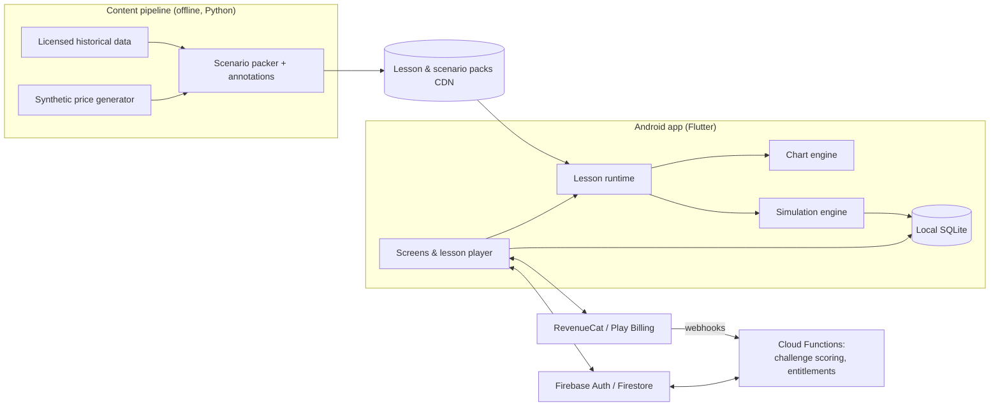

# 📈 Trading Academy — Product & Build Plan

> **Working title.** Check name availability on Google Play and trademark databases
> before branding. Status: **plan agreed, build starting (Phase 0/1).**

An Android app (Play Store first, iOS later) that teaches beginners **how to read
any market** — stocks, forex, crypto, commodities, indices — through bite-sized
interactive lessons, live-drawn charts, and **risk-free simulated trades**.
Free lessons to start; a paid tier unlocks the full curriculum and practice tools.

---

## 0. Decisions (30 Sep 2026)

| Topic | Decision | What it means |
|---|---|---|
| **Who builds it** | Claude writes the code | The owner doesn't need to install Flutter or Android tools. Code lives on GitHub; **GitHub Actions** builds the signed app bundle (`.aab`) for upload to Play. Claude verifies work with automated tests and by rendering screens in a browser. |
| **Stack** | **Flutter** | Free, open-source toolkit from Google; one codebase for Android now and iOS later. |
| **Lesson content** | Written and self-checked by Claude against standard, widely taught definitions | Beginner material is well established. Recommended: one read-through by an experienced trader before public launch. |
| **Play developer account** | **Personal** (not created yet) | $25 one-time fee + identity verification. **Closed test with ≥ 12 testers for 14 continuous days** before production. A Google **payments profile** is needed to sell subscriptions. Because the app earns money, EU law (Digital Services Act) makes the developer a "trader": **contact details (address, phone, email) are shown on the EU store listing**, so consider a business address or PO box instead of a home address. |
| **Launch markets** | **All of Europe (EU/EEA, UK, Switzerland and the rest) + USA** | English at launch, app built translation-ready; add major EU languages in Phase 3. Prices in EUR, GBP, CHF, USD etc. via Play regional pricing. GDPR / UK GDPR apply (see §9). |
| **Repository** | Dedicated repo: [`Educational-trading-app`](https://github.com/vexantgaming-cpu/Educational-trading-app) | Separate from the Smoke-Free Coach repo. |

---

## 1. Product principles

1. **Learn by doing.** Every lesson ends with the learner touching a chart: tapping a
   level, dragging a stop-loss, or taking a simulated trade.
2. **Instrument-agnostic.** Price action, structure and risk work the same way on a
   stock, a currency pair or a coin. Lessons teach the concept once, then show it
   across several markets. "Blind charts" (ticker and dates hidden) train reading
   the price itself rather than reacting to a name.
3. **Risk management first, and always free.** Teaching position sizing and stop-losses
   is the most protective thing we can do for a beginner, so it stays out of the paywall.
4. **Reward process, not luck.** Scores and badges come from *how* a trade was taken
   (had a stop, sensible risk:reward, followed the plan), not from P&L alone.
5. **Simulated money only.** No real trading, no broker, no purchasable virtual cash
   (see §9 for why).
6. **Beginner-friendly by default.** Plain language, one concept per lesson, 3–5
   minutes each, tap any underlined term for a glossary pop-up.

---

## 2. Who it's for

| Persona | Situation | What they need |
|---|---|---|
| **Curious Beginner** | Never traded; hears about markets from friends/social media | Zero jargon, confidence, "what is a candle?" |
| **Burned Self-Learner** | Watched videos, opened an account, lost money | Structure, risk management, a fix for bad habits |
| **Crypto-First** | Young, mobile-native, trades coins on impulse | Learning that the same chart skills apply everywhere; discipline |

Target audience in Play Console: **18+** (financial content; also keeps us out of the
Families policy scope).

---

## 3. Curriculum — "reading the market, whatever the instrument"

Structured as a Duolingo-style path. ~60 lessons across 7 levels. Each lesson is
3–5 minutes: **explain → interact → mini-trade → recap**.

### Level 0 — Market Foundations · FREE
1. What a market is: buyers, sellers, and price as an agreement
2. Bid, ask and spread: the cost of every trade
3. Instruments tour: stocks, forex, crypto, commodities, indices, futures/CFDs.
   What differs (trading hours, tick/pip size, contract size, leverage) and what doesn't
4. Order types: market, limit, stop. Going long vs short
5. Reading a candlestick: open, high, low, close, body, wick. Line vs bar vs candle
6. Timeframes: same market, different stories
7. Volume and liquidity basics

### Level 1 — Market Structure · FREE
8. Trends: higher highs/higher lows, lower highs/lower lows
9. Ranges and consolidation
10. Swing highs and swing lows
11. Support and resistance as *zones*, not lines
12. Role reversal: when support becomes resistance
13. Trendlines and channels
14. Breakouts vs fakeouts
15. Pullbacks and retracements (incl. an intro to Fibonacci levels)
16. Multi-timeframe analysis: top-down reading

### Level 2 — Risk Management · FREE (always)
17. Why most beginners lose: risk of ruin
18. Risk per trade and the 1% guideline
19. Placing a stop-loss where the idea is wrong (structure-based stops)
20. Take-profit and risk:reward ratio
21. Win rate × R:R = expectancy
22. Position sizing calculator (the same formula for shares, lots, contracts and coins)
23. Leverage and margin: how accounts blow up
24. Drawdown maths: lose 50%, need +100% to recover
25. Fees, spread and slippage: the hidden costs

### Level 3 — Candlestick & Chart Patterns · PREMIUM
Engulfing, pin bar/hammer, doji, inside bar. Double top/bottom, head & shoulders,
triangles, flags & pennants, wedges, cup & handle. Capstone lesson: **context beats
pattern** (the same pattern at support vs in mid-range).

### Level 4 — Indicators · PREMIUM
Moving averages (SMA/EMA) and dynamic support; RSI and divergence; MACD;
Bollinger Bands; ATR (volatility-based stops); VWAP; volume profile basics.
Capstone: **indicator pitfalls**: lag, overfitting, and indicator stacking.

### Level 5 — Market Context · PREMIUM
Trading sessions and liquidity (Asia/London/New York), gaps, the economic calendar
and high-impact news, earnings, correlations and risk-on/risk-off, sentiment,
a fundamental vs technical overview.

### Level 6 — Your Trading Plan · PREMIUM
Defining a setup with an entry checklist; the trade journal; reviewing your
trades; backtesting basics and sample size; psychology (FOMO, revenge trading,
overtrading, loss aversion); **from simulator to real money**: what changes, how
to check a broker is regulated, and why to start tiny. Neutral, with no broker recommendations.

> Content must be reviewed by an experienced trader or qualified professional before
> launch. Every lesson carries the "educational, not financial advice" footer.

---

## 4. Interactive exercise types (the core of the app)

All exercises run on the app's own chart engine (§7) with scored hit-testing.

| Exercise | What the learner does | How it's scored |
|---|---|---|
| **Spot it** | Tap the swing high / support zone / engulfing candle | Tap within a tolerance zone around the reference answer |
| **Draw it** | Drag a horizontal level or trendline onto the chart | Distance/angle from the reference line, with partial credit |
| **What's next?** | Chart pauses; pick Up / Down / Sideways, then watch it replay | Correctness plus a short explanation of *why* (framed as probability, never certainty) |
| **Place the trade** | Drag entry, stop-loss and take-profit lines; app shows R:R and position size live | Process score: stop placed logically, R:R ≥ target, size within risk % |
| **Size it** | Given balance, risk % and stop distance, compute the position | Exact answer within rounding |
| **Journal it** | Tag why the trade was taken and how it felt | Completion (feeds analytics) |

### "Small trades you can take freely": three places to trade

1. **Mini-trades inside lessons** (about 1 min): one scenario chart, one decision, instant replay.
2. **Daily Challenge**: the same chart for every user each day, one trade, a
   leaderboard ranked by **process score**, not raw profit.
3. **Practice Arena**: bar-by-bar replay of a longer chart with a virtual balance
   (e.g. $10,000 virtual). Buy/sell, set stops and targets, control replay speed,
   reset any time. Free users get a daily allowance; premium is unlimited.

---

## 5. Engagement & gamification (ethical by design)

- **XP, levels, streaks** (with streak freezes), a learning-path map, badges such as
  *"First stop-loss placed"* or *"10 trades with R:R ≥ 2"*.
- **"Good loss" feedback**: "You respected your stop. That's a well-managed loss."
- Opt-in daily reminder and "today's challenge is live" notification, capped at 1/day.
- **Deliberately excluded:** loot boxes, buying virtual money, pure P&L leaderboards,
  casino-style effects for big wins, streak-guilt messaging.

---

## 6. Free vs Premium

| Feature | Free | Premium |
|---|---|---|
| Levels 0–2 (Foundations, Structure, Risk) | ✅ | ✅ |
| Levels 3–6 (Patterns, Indicators, Context, Plan) | Preview lesson each | ✅ |
| New monthly lesson packs | — | ✅ |
| Daily Challenge | ✅ | ✅ + challenge history |
| Practice Arena | 3 sessions/day, synthetic charts | Unlimited, real historical data, all timeframes, multi-timeframe view |
| Indicators & drawing tools | MA, volume, horizontal lines | Full set |
| Trade journal | Last 20 trades | Unlimited + export |
| Performance analytics | Win rate, P&L | Expectancy, avg R, drawdown, mistake breakdown |
| Completion certificates (non-accredited) | — | ✅ |
| Later: AI trade review coach | — | ✅ |

**Pricing hypotheses to A/B test** (via Remote Config + RevenueCat offerings):
- US: monthly ~ $7.99–9.99 · annual ~ $49.99–59.99 (headline offer) · 7-day free trial on annual
- Western Europe/UK/CH: equivalent in EUR/GBP/CHF (e.g. €8.99 / €54.99); Central &
  Eastern Europe: lower local prices via Play Console **regional pricing**.
- EU consumer prices must include VAT; Google Play collects and remits VAT on these sales.
- **Paywall placement:** soft paywall after finishing Level 2 (the learner has already
  seen real value), plus contextual locks on premium features. Never interrupt a lesson.

---

## 7. Technical architecture

### Recommended stack

| Layer | Choice | Why |
|---|---|---|
| App | **Flutter (Dart)** | One codebase for Android now and iOS later; `CustomPainter` gives full control over the chart, which *is* the product (drag handles, tap targets, replay animation at 60 fps) |
| Chart engine | **Custom Flutter widget** (candles, volume, MA/RSI/etc., lines, zones, gestures) | Exercises need precise hit-testing and draggable overlays. Fallback: TradingView Lightweight Charts in a WebView (Apache-2.0, **requires TradingView attribution** in-app) |
| Simulation engine | Pure Dart package, no Flutter dependency | Deterministic and fully unit-testable; runs offline |
| Local storage | SQLite via Drift | Progress, journal, arena state; offline-first |
| Auth & sync | Firebase Auth (anonymous start → Google Sign-In), Firestore | No signup wall before the first lesson |
| Server logic | Cloud Functions | Daily challenge scoring and anti-cheat, entitlement webhooks |
| Payments | Google Play Billing via **RevenueCat** | Entitlements, trials, experiments; iOS-ready later |
| Config & experiments | Firebase Remote Config | Paywall/pricing tests, feature flags |
| Quality & analytics | Crashlytics, Firebase Analytics | Funnels and learning KPIs (§10) |
| Content delivery | Versioned JSON lesson packs on a CDN (Firebase Hosting/Storage) | Ship new lessons without an app release; Level 0 bundled for offline |

Alternative if the team is JavaScript-native: React Native + Expo + Skia-based charts.
The rest of the plan stays the same.

### High-level diagram



### Lessons as data

Lessons are authored as JSON (validated against a schema), so a content writer
can add lessons without touching app code:

```json
{
  "id": "L1-11-support-resistance",
  "level": 1, "title": "Support & resistance are zones", "premium": false,
  "steps": [
    { "type": "explain", "text": "Price often pauses where buyers stepped in before…",
      "chart": { "scenario": "syn-range-042", "highlight": { "zone": [101.2, 102.0] } } },
    { "type": "spot_it", "prompt": "Tap the support zone.",
      "chart": { "scenario": "syn-range-043" },
      "answer": { "zone": [98.4, 99.1], "tolerance": 0.3 } },
    { "type": "place_trade", "prompt": "Price is back at support. Plan a long.",
      "chart": { "scenario": "syn-range-043", "revealBars": 40 },
      "rules": { "requireStop": true, "minRR": 1.5, "maxRiskPct": 1 } },
    { "type": "recap", "bullets": ["Zones, not lines", "More touches = more attention", "Stops go beyond the zone"] }
  ]
}
```

### Simulation engine rules (v1)

- **Instrument spec abstraction:** tick size, tick value, contract/lot size, leverage,
  spread and commission. One model covers shares, FX lots, futures and coins.
- **Orders:** market, limit and stop; long and short; attached SL/TP; one position per scenario in v1.
- **Fills:** market orders fill at the next bar open plus spread; limit/stop orders fill
  when the bar's range crosses the price; gaps fill at the open.
- **Ambiguous bar rule:** if a bar hits both SL and TP, assume **SL first** (conservative,
  and it teaches the right lesson).
- **Deterministic & seeded:** the same scenario and the same actions always give the same
  result, which the challenge anti-cheat relies on (server re-simulates submitted actions).
- **Stats:** win rate, average R, expectancy, profit factor, max drawdown, rule adherence %.

### Market data strategy

- **Synthetic-first:** a generator (random walk + regime switching + injected
  patterns) produces clean teaching charts with known answers and **no licensing cost**.
- **Real historical data** for Arena/premium: license from a provider whose terms
  allow **display in a consumer app**. Many free APIs forbid redistribution, so check the
  terms before using any source.
- Optional price rebasing and hidden tickers for blind-chart practice.

---

## 8. Key screens & flows

1. **Onboarding (under 60 s, no signup):** goal → experience level → markets of interest
   (used only to pick example charts) → daily time goal (5/10/15 min) → optional
   placement quiz → **first lesson immediately**.
2. **Learn:** path map by level, progress rings, lock icons on premium.
3. **Lesson player:** full-screen chart, step cards, glossary pop-ups, "explain simpler" toggle.
4. **Practice:** Daily Challenge card + Practice Arena (instrument/timeframe picker,
   replay controls, order ticket with draggable SL/TP).
5. **Journal & Stats:** trade list, tags, process-score trend, mistakes breakdown.
6. **Profile:** streak, badges, subscription, notification settings, **delete account**.
7. **Paywall:** value-focused (what you'll learn next), clear trial terms, restore purchases.

Accessibility: colour-blind-safe candle themes (e.g. blue/orange, or hollow/filled),
dynamic text size, screen-reader labels for chart summaries.

---

## 9. Compliance & trust (non-negotiable)

- **Education only:** no signals, no personalised recommendations, no "buy X now".
  Depending on the country, specific recommendations can count as regulated investment advice.
- **No real-money trading and no broker integration in v1.** Executing real trades would
  require broker/investment-firm licensing.
- **Virtual money can't be bought or cashed out.** This keeps the simulator clearly
  educational and away from simulated-gambling territory. Premium buys *content and tools*,
  never virtual balance.
- **No broker affiliate deals at launch.** CFD promotion is tightly restricted in the
  EU/UK, and it would undermine trust.
- **Play Console requirements:**
  - Financial features declaration: required for *every* app, including ones with no
    financial features. We declare none.
  - Data safety form, IARC content rating, target audience 18+.
  - **Account deletion**, both in-app and via a web link, is required because we allow account creation.
  - New *personal* developer accounts must run a **closed test with ≥ 12 testers for
    14 continuous days** before production access (organization accounts are exempt).
    Plan for this in the timeline.
- **Privacy (Europe + US):** GDPR / UK GDPR privacy policy, minimal data collection,
  analytics and crash reporting **off until the user consents** in Europe, Firestore data
  stored in an **EU region**, data export/deletion on request.
- **EU Digital Services Act:** declare "trader" status in Play Console; developer contact
  details become visible to EU users (see §0).
- **UK:** strict rules on promoting crypto and other investments. Lessons use crypto charts
  only as neutral examples and never promote a specific coin, exchange or broker.
- **US:** keep content general and impersonal. No individual recommendations, no
  "guaranteed returns" style marketing (FTC advertising rules apply to store listings and ads).
- **Disclaimers:** on onboarding, the lesson footer and the arena screen ("Simulated results
  do not reflect real trading; trading involves risk of loss").
- A legal review before launch, especially for the EU/UK/US markets.

---

## 10. Success metrics

| Area | KPI | Initial target |
|---|---|---|
| Activation | First lesson + first simulated trade in the first session | ≥ 60% |
| Retention | D1 / D7 / D30 | 40% / 20% / 10% |
| Engagement | Lessons per weekly active user | ≥ 4 |
| Monetization | Trial start rate from paywall view; trial → paid | 8–12%; 35–50% |
| **Learning** | % of arena trades with a stop-loss, week 1 vs week 4 | Rising trend |
| **Learning** | Quiz accuracy on spaced-repetition review | ≥ 80% |

Targets are starting assumptions to revisit after the closed test.

---

## 11. Roadmap

Assumes 1–2 developers, a designer (part-time) and a content author with trading experience.

| Phase | Duration | Deliverables |
|---|---|---|
| **0 · Discovery & prototype** | 2–3 wks | Final curriculum outline, wireframes, brand; chart-engine spike; clickable prototype of *Spot it*, *Place the trade*, *What's next?*; test with 5–8 real beginners |
| **1 · MVP** | 8–10 wks | Chart engine, simulation engine (unit-tested), lesson runtime + schema, Levels 0–2 (~25 lessons), Daily Challenge, Practice Arena (synthetic), local progress, anonymous auth, glossary |
| **2 · Monetize & launch** | 4–6 wks | RevenueCat paywall + trial, Levels 3–4, account sync, analytics, store listing, policy declarations, **14-day closed test (12+ testers)** → production |
| **3 · Grow** | ongoing | Levels 5–6, licensed real historical data, multi-timeframe arena, journal analytics, localisation, iOS |
| **4 · Later ideas** | — | AI trade-review coach (explains *why* a simulated trade was good or bad against the lesson rules), strategy backtest lab, web companion, community |

---

## 12. Risks & mitigations

| Risk | Mitigation |
|---|---|
| Content drifts into "advice" | Editorial guidelines, legal review, no signals |
| Inaccurate teaching content | Expert review of every lesson; user "report an issue" button |
| Custom chart engine takes longer than planned | Phase 0 spike; WebView + Lightweight Charts fallback |
| Data licensing costs/terms | Synthetic-first; real data only in premium, from a properly licensed source |
| App feels like gambling | Process-based scoring, no purchasable virtual cash, no P&L glory |
| Crowded market (text courses such as Babypips, simulators such as TradingView paper trading and Investopedia Simulator) | Differentiate on *interactive, exercise-driven* lessons, instrument-agnostic skills, and process scoring |
| Closed-test gate delays launch | Recruit testers during Phase 1; start the 14-day clock as soon as the MVP is stable |

---

## 13. Open questions

Answered on 30 Sep 2026: see §0. Still open:

1. **Name & brand** (working title for now).
2. **12 closed-test testers:** start collecting Gmail addresses of friends/family who will
   install the test build and keep it for 14 days.
3. **Budget** for optional extras: licensed real market data (premium Arena), a legal
   review before launch, design polish.
4. **Languages** to add after English, in priority order.

## 14. Next steps

1. ✅ Plan and decisions agreed.
2. ✅ Dedicated GitHub repo created.
3. ✅ Flutter project + **simulation engine** (pure logic, 43 tests).
4. ✅ Chart engine: candles, volume, moving average, draggable SL/TP lines, zones, tap hit-testing (pan/zoom still to do).
   ✅ First exercise: "Place the trade".
5. Synthetic scenario generator + first 3 lessons in JSON.
6. GitHub Actions: ✅ tests + installable test APK on every push; signed `.aab` for Play in Phase 2.
7. Clickable prototype → beginner usability test → iterate.
8. Owner registers the Play developer account (personal) and payments profile.
